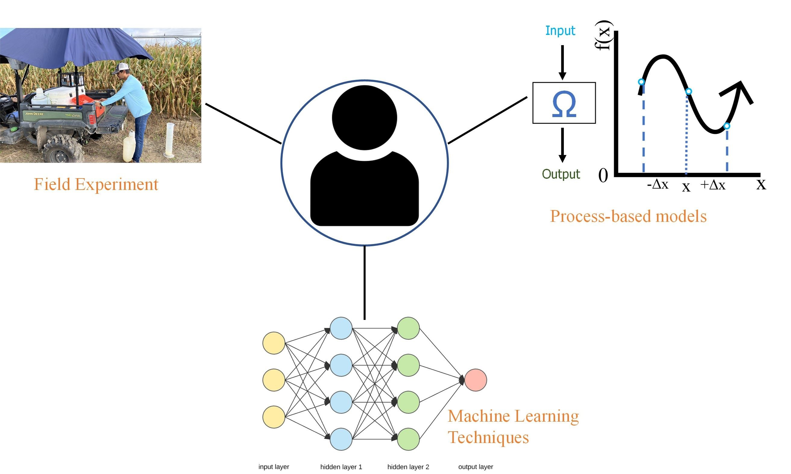

**Field of Study**: My field of study is [agricultural water and nutrient management](www.nifa.usda.gov/about-nifa/impacts/dashboard-agricultural-water-use-nutrient-management), employing a multi-disciplinary approach that includes field research, process-based modeling, remote sensing, and machine learning techniques.  
     
**Current Research Highlights**: Intensive agriculture practices in <a href="https://www.usgs.gov/mission-areas/water-resources/science/karst-aquifers">karstic</a> sandy soils have resulted in elevated <a href="https://www.mysuwanneeriver.com/DocumentCenter/View/130/2007-Nitrate-Trend-Report?bidId=">nitrate concentrations</a> in Florida water bodies. Therefore, there is a critical need to find a balance between sustained productivity and improved water quality. In response to this issue, my study proposes <a href="https://www.ams.usda.gov/grades-standards/crop-rotation-practice-standard#:~:text=Section%20205.205%2C%20the%20crop%20rotation%20practice%20standard%2C%20is,conserve%20nutrients%2C%20and%20protect%20the%20soil%20against%20erosion.">rotational production</a> as a potential <a href="https://www.fdacs.gov/Agriculture-Industry/Water/Agricultural-Best-Management-Practices">best management practice (BMP)</a> to mitigate environmental nitrate load. To achieve this objective, I am employing a multi-disciplinary approach that includes <a href="https://edis.ifas.ufl.edu/publication/AE581">field research</a>, process-based modeling, and machine learning techniques.   

